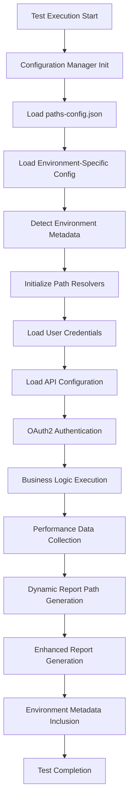

# Acos GRAF - Load Test Architecture

**Version:** 3.0.0  
**Last Updated:** October 7, 2025

## 📋 Table of Contents

1. [System Overview](#system-overview)
2. [Architecture Evolution](#architecture-evolution)
3. [Core Architecture Layers](#core-architecture-layers)
4. [Centralized Configuration System](#centralized-configuration-system)
5. [Test Suite Components](#test-suite-components)
6. [Data Flow & Interactions](#data-flow--interactions)
7. [Path Management Architecture](#path-management-architecture)
8. [Environment Metadata System](#environment-metadata-system)
9. [Module Dependencies](#module-dependencies)
10. [Test Execution Flow](#test-execution-flow)
11. [Document Attachment Architecture](#document-attachment-architecture)
12. [Performance Testing Patterns](#performance-testing-patterns)
13. [Extensibility & Best Practices](#extensibility--best-practices)

---

## System Overview

### Purpose

**Acos GRAF (Generic Reusable Automation Framework) - Load Test** is a comprehensive K6-based performance testing framework designed for WebSak Plus, focusing on Case (Sak) and Journal Post (JP) creation workflows with advanced document attachment capabilities and centralized configuration management.

### Key Architectural Features

✅ **Centralized Path Management**
- Single point of control for all framework paths
- Environment-specific path configurations
- Dynamic path resolution with fallback defaults
- No hardcoded paths in test or framework code

✅ **Enhanced Environment Awareness**
- Automatic environment detection and metadata collection
- Environment-specific configuration overrides
- Dynamic configuration loading based on environment

✅ **Modular Architecture**
- Separation of concerns with clear layer boundaries
- Reusable components across test scenarios
- Pluggable configuration system

✅ **Advanced Configuration System**
- Multi-layered configuration management
- Flag-based configuration control
- JSON-based configuration files with validation

### Technology Stack

- **K6 v0.x** - Load testing framework
- **JavaScript (ES6+)** - Test scripting with modern features
- **OAuth2/OIDC** - Authentication protocol
- **JSON** - Configuration format with schema validation
- **PowerShell** - NPM scripts (Windows environment)
- **Node.js** - Development tooling and package management

---

## Architecture Evolution

### Version 3.0.0 Enhancements

🆕 **Centralized Path Management**
- Introduced `src/config/paths-config.json` for all path configurations
- Enhanced `config-manager.js` with path resolution functions
- Eliminated hardcoded paths from all framework files

🆕 **Enhanced Environment Metadata**
- Added automatic environment detection
- Enhanced report generation with environment details
- Improved debugging and tracking capabilities

🆕 **Configuration System Improvements**
- Multi-layered configuration loading
- Environment-specific overrides
- Fallback mechanisms for missing configurations

### Migration from Previous Versions

```javascript
// Before v3.0.0 (hardcoded paths)
const reportPath = 'src/reports/test-report.html';

// After v3.0.0 (configurable paths)
import { getReportPaths } from '../lib/config-manager.js';
const reportPath = getReportPaths().getHtmlPath('test');
```

---

## Core Architecture Layers

```
┌─────────────────────────────────────────────────────────────────────────────┐
│                            Test Scenarios Layer                              │
│  ┌─────────────────┐  ┌─────────────────┐  ┌─────────────────────────────┐ │
│  │   create-sak    │  │   create-jp     │  │  create-jp-with-multiple-   │ │
│  │      .js        │  │      .js        │  │       document.js           │ │
│  │                 │  │                 │  │                             │ │
│  │ • Smoke Tests   │  │ • JP Workflows  │  │ • Document Attachments      │ │
│  │ • Load Tests    │  │ • Performance   │  │ • Batch Processing          │ │
│  │ • Stress Tests  │  │ • Validation    │  │ • File Upload Testing       │ │
│  └─────────────────┘  └─────────────────┘  └─────────────────────────────┘ │
│  ┌───────────────────────────────────────────────────────────────────────┐ │
│  │            create-multiplejp-with-multiple-document.js                │ │
│  │                                                                       │ │
│  │  • Bulk JP Creation    • High-Volume Processing                       │ │
│  │  • Multiple Documents  • Production Workload Simulation               │ │
│  └───────────────────────────────────────────────────────────────────────┘ │
└─────────────────────────────────────────────────────────────────────────────┘
                                      ↓
┌─────────────────────────────────────────────────────────────────────────────┐
│                        Configuration Management Layer                        │
│  ┌───────────────────────────────────────────────────────────────────────┐ │
│  │                     🆕 Enhanced Config Manager                         │ │
│  │                          config-manager.js                           │ │
│  │                                                                       │ │
│  │  • getPathsConfig()          • getEnvironmentMetadata()              │ │
│  │  • getReportPaths()          • getApiEndpoints()                     │ │
│  │  • getTestDataPaths()        • Configuration Loading                 │ │
│  │  • Dynamic Path Resolution   • Environment Detection                 │ │
│  └───────────────────────────────────────────────────────────────────────┘ │
└─────────────────────────────────────────────────────────────────────────────┘
                                      ↓
┌─────────────────────────────────────────────────────────────────────────────┐
│                          Core Business Logic Layer                           │
│  ┌─────────────────┐  ┌─────────────────┐  ┌─────────────────────────────┐ │
│  │  auth-module    │  │  case-module    │  │        jp-module            │ │
│  │                 │  │                 │  │                             │ │
│  │ • OAuth2 Auth   │  │ • Case Creation │  │ • JP Creation Workflows     │ │
│  │ • Token Mgmt    │  │ • Template Mgmt │  │ • Document Attachments      │ │
│  │ • Multi-user    │  │ • Validation    │  │ • Payload Construction      │ │
│  │ • Credentials   │  │ • Error Handle  │  │ • 🆕 Configurable Endpoints │ │
│  └─────────────────┘  └─────────────────┘  └─────────────────────────────┘ │
└─────────────────────────────────────────────────────────────────────────────┘
                                      ↓
┌─────────────────────────────────────────────────────────────────────────────┐
│                       Framework Utilities Layer (DEPRECATED)                 │
│  ┌─────────────────┐  ┌─────────────────┐  ┌─────────────────────────────┐ │
│  │  api-client     │  │ report-generator│  │      error-tracker          │ │
│  │                 │  │                 │  │                             │ │
│  │ • HTTP Wrapper  │  │ • HTML Reports  │  │ • Error Analytics           │ │
│  │ • Request Logic │  │ • JSON Summary  │  │ • Failure Tracking          │ │
│  │ • Response Val  │  │ • Apdex Scoring │  │ • Debug Information         │ │
│  └─────────────────┘  └─────────────────┘  └─────────────────────────────┘ │
│  ┌─────────────────┐  ┌─────────────────┐  ┌─────────────────────────────┐ │
│  │     pacing      │  │   validation    │  │                             │ │
│  │                 │  │                 │  │                             │ │
│  │ • Think Time    │  │ • Response Val  │  │                             │ │
│  │ • Pacing Logic  │  │ • Assertions    │  │                             │ │
│  └─────────────────┘  └─────────────────┘  └─────────────────────────────┘ │
└─────────────────────────────────────────────────────────────────────────────┘
                                      ↓
┌─────────────────────────────────────────────────────────────────────────────┐
│                          Configuration Data Layer                            │
│  ┌─────────────────┐  ┌─────────────────┐  ┌─────────────────────────────┐ │
│  │ 🆕 paths-config │  │  autotest.json  │  │     users-config.json       │ │
│  │      .json      │  │                 │  │                             │ │
│  │                 │  │ • Test Scenarios│  │ • User Credentials          │ │
│  │ • Report Paths  │  │ • Load Profiles │  │ • Multi-user Support        │ │
│  │ • Data Paths    │  │ • Thresholds    │  │ • OAuth2 Config             │ │
│  │ • API Endpoints │  │ • Performance   │  │                             │ │
│  │ • External URLs │  │   Criteria      │  │                             │ │
│  └─────────────────┘  └─────────────────┘  └─────────────────────────────┘ │
│  ┌─────────────────┐  ┌─────────────────────────────────────────────────────┐ │
│  │   dev.json      │  │              websak-api-config.json                │ │
│  │                 │  │                                                     │ │
│  │ • Dev Settings  │  │ • API Endpoints        • OAuth2 Configuration      │ │
│  │ • Debug Flags   │  │ • Service URLs         • Authentication Settings   │ │
│  │ • Local Config  │  │ • Request Templates    • API Version Management    │ │
│  └─────────────────┘  └─────────────────────────────────────────────────────┘ │
│  ┌───────────────────────────────────────────────────────────────────────────┐ │
│  │                      testDocuments/ (Binary Files)                       │ │
│  │                                                                           │ │
│  │  • 1MB-10MB Test Files    • Multiple Format Support (PDF, DOCX)          │ │
│  │  • Performance Benchmarks • Real-world File Testing                      │ │
│  └───────────────────────────────────────────────────────────────────────────┘ │
└─────────────────────────────────────────────────────────────────────────────┘
                                      ↓
┌─────────────────────────────────────────────────────────────────────────────┐
│                           External Services Layer                            │
│  ┌─────────────────────┐    ┌─────────────────────────────────────────────┐ │
│  │   Identity Server   │    │            WebSak Plus API                  │ │
│  │    (OAuth2/OIDC)    │    │                                             │ │
│  │                     │    │  • Case Management        • JP Management   │ │
│  │ • Token Endpoint    │◄──►│  • Template Services      • Document Upload │ │
│  │ • Client Creds      │    │  • Validation APIs        • File Processing │ │
│  │ • Token Validation  │    │  • Error Responses        • Status Tracking │ │
│  └─────────────────────┘    └─────────────────────────────────────────────┘ │
└─────────────────────────────────────────────────────────────────────────────┘
```

---

## Centralized Configuration System

### 🆕 Configuration Architecture

The framework implements a **3-layer configuration system**:

1. **Base Configuration**: Default settings and fallbacks
2. **Environment Configuration**: Environment-specific overrides  
3. **Runtime Configuration**: Dynamic settings and user preferences

### Configuration Manager Enhanced Functions

```javascript
// Path Management Functions
getPathsConfig()          // Load centralized path configuration
getReportPaths()          // Get dynamic report path generators  
getTestDataPaths()        // Get test data file locations
getApiEndpoints()         // Get configurable API endpoint patterns
getExternalUrls()         // Get external resource URLs

// Environment Functions  
getEnvironmentMetadata()  // Get environment details and metadata
detectEnvironment()       // Automatic environment detection
loadEnvironmentConfig()   // Load environment-specific settings

// Utility Functions
validateConfiguration()   // Validate configuration completeness
getConfigurationSummary() // Get configuration loading summary
```

### 🆕 Centralized Path Configuration

**File**: `src/config/paths-config.json`

```json
{
  "description": "Centralized path configuration for Acos GRAF Load Test framework",
  "version": "1.0.0",
  "lastUpdated": "2025-10-07",
  
  "paths": {
    "reports": {
      "baseDir": "src/reports",
      "htmlSuffix": "-report.html", 
      "jsonSuffix": "-summary.json"
    },
    "testData": {
      "baseDir": "src/data",
      "testDocuments": "src/data/testDocuments",
      "usersConfig": "src/data/users-config.json",
      "apiConfig": "src/data/websak-api-config.json"
    },
    "apiEndpoints": {
      "websak": {
        "base": "/api/websak/api",
        "endpoints": {
          "jpAttach": "/jp/uploadfiletodokument/",
          "caseCreate": "/case/create",
          "templateGet": "/templates"
        }
      }
    },
    "external": {
      "papaparseUrl": "https://jslib.k6.io/papaparse/5.1.1/index.js"
    }
  }
}
```

### Configuration Loading Process

```javascript
// 1. Initialize Configuration Manager (K6 Init Phase)
import { 
  getPathsConfig, 
  getReportPaths, 
  getEnvironmentMetadata 
} from '../lib/config-manager.js';

// 2. Load Path Configuration
const pathsConfig = getPathsConfig();
const reportPaths = getReportPaths();

// 3. Generate Dynamic Paths
export function handleSummary(data) {
  const testName = 'create-sak';
  return {
    [reportPaths.getHtmlPath(testName)]: htmlReport(data),
    [reportPaths.getJsonPath(testName)]: JSON.stringify(data)
  };
}

// 4. Environment Metadata Collection
const envMetadata = getEnvironmentMetadata();
console.log(`Environment: ${envMetadata.environment}`);
console.log(`Use Data File Config: ${envMetadata.useDataFileConfig}`);
```

---

## Test Suite Components

### 1. Case (Sak) Creation Test

**File**: `tests/api/cases/create-sak.js`

**Architecture**:
```javascript
┌─────────────────────────────────────────────────────────────┐
│                    Create Sak Test Flow                      │
├─────────────────────────────────────────────────────────────┤
│ 1. Configuration Loading                                    │
│    • Load paths configuration                               │
│    • Load environment metadata                              │
│    • Load user credentials                                  │
│    • Load API configuration                                 │
├─────────────────────────────────────────────────────────────┤
│ 2. Authentication Phase                                     │
│    • OAuth2 client credentials flow                         │
│    • Token acquisition and validation                       │
│    • Multi-user credential rotation                         │
├─────────────────────────────────────────────────────────────┤
│ 3. Template Retrieval                                       │
│    • Get available case templates                           │
│    • Template validation and selection                      │
│    • Error handling for missing templates                   │
├─────────────────────────────────────────────────────────────┤
│ 4. Case Creation                                            │
│    • Payload construction with template data                │
│    • HTTP POST to configurable endpoint                     │
│    • Response validation and error tracking                 │
├─────────────────────────────────────────────────────────────┤
│ 5. Performance Measurement                                  │
│    • Response time tracking                                 │
│    • Success rate monitoring                                │
│    • Error categorization and analysis                      │
├─────────────────────────────────────────────────────────────┤
│ 6. Report Generation                                        │
│    • HTML report with configurable path                     │
│    • JSON summary with environment metadata                 │
│    • Apdex scoring and performance analysis                 │
└─────────────────────────────────────────────────────────────┘
```

### 2. Journal Post (JP) Creation Tests

**Files**: 
- `tests/api/journalposts/create-jp.js`
- `tests/api/journalposts/create-jp-with-multiple-document.js`
- `tests/api/journalposts/create-multiplejp-with-multiple-document.js`

**Enhanced Architecture**:
```javascript
┌─────────────────────────────────────────────────────────────────────────────┐
│                         JP Creation Test Suite                               │
├─────────────────────────────────────────────────────────────────────────────┤
│ Configuration & Environment Setup                                            │
│ • Centralized path configuration loading                                     │
│ • Environment-aware configuration selection                                  │
│ • Dynamic API endpoint resolution                                            │
│ • Test document path resolution                                              │
├─────────────────────────────────────────────────────────────────────────────┤
│ Authentication & Session Management                                          │
│ • OAuth2 token management with refresh                                       │
│ • Multi-user session handling                                                │
│ • Session state validation                                                   │
├─────────────────────────────────────────────────────────────────────────────┤
│ Prerequisite Case Creation                                                   │
│ • Dynamic case creation for JP attachment                                    │
│ • Case ID validation and storage                                             │
│ • Error handling for case creation failures                                  │
├─────────────────────────────────────────────────────────────────────────────┤
│ JP Template & Creation Pipeline                                              │
│ • JP template retrieval with configurable endpoints                          │
│ • Multiple JP type support (incoming/outgoing)                               │
│ • Bulk JP creation with parallel processing                                  │
│ • JP validation and status tracking                                          │
├─────────────────────────────────────────────────────────────────────────────┤
│ Document Attachment Architecture                                             │
│ • Configurable test document paths                                           │
│ • Multiple document format support (PDF, DOCX)                               │
│ • File size validation (1MB-10MB)                                            │
│ • Batch upload processing                                                    │
│ • Document attachment validation                                              │
├─────────────────────────────────────────────────────────────────────────────┤
│ Performance Monitoring & Analytics                                           │
│ • Real-time performance metric collection                                    │
│ • Document upload performance analysis                                       │
│ • Bulk operation performance tracking                                        │
│ • Error categorization and failure analysis                                  │
├─────────────────────────────────────────────────────────────────────────────┤
│ Enhanced Reporting System                                                    │
│ • Configurable report output paths                                           │
│ • Environment metadata inclusion                                             │
│ • Document processing performance metrics                                    │
│ • Comprehensive error tracking and analysis                                  │
└─────────────────────────────────────────────────────────────────────────────┘
```

---

## Data Flow & Interactions

### 🆕 Enhanced Data Flow with Centralized Configuration



### Configuration Resolution Flow

1. **Init Phase**: Load `paths-config.json` and establish path resolvers
2. **Environment Detection**: Automatically detect environment and load overrides
3. **Dynamic Resolution**: Resolve all paths dynamically based on configuration
4. **Fallback Handling**: Use default paths if configuration is missing
5. **Validation**: Validate configuration completeness and log warnings

### API Interaction Flow

```javascript
// Enhanced API interaction with configurable endpoints
import { getApiEndpoints } from '../lib/config-manager.js';

// 1. Get configurable API endpoints
const apiEndpoints = getApiEndpoints();

// 2. Build API URLs dynamically
const jpAttachUrl = `${baseUrl}${apiEndpoints.websak.base}${apiEndpoints.websak.endpoints.jpAttach}${jpId}`;

// 3. Fallback to defaults if configuration missing
const fallbackUrl = jpAttachUrl || `${baseUrl}/api/websak/api/jp/uploadfiletodokument/${jpId}`;
```

---

## Path Management Architecture

### 🆕 Dynamic Path Resolution System

The framework implements a sophisticated path management system that eliminates hardcoded paths and provides flexibility for different deployment scenarios.

#### Core Path Management Components

```javascript
// Path Configuration Structure
{
  "paths": {
    "reports": {
      "baseDir": "src/reports",           // Base directory for reports
      "htmlSuffix": "-report.html",       // HTML report suffix
      "jsonSuffix": "-summary.json"       // JSON summary suffix
    },
    "testData": {
      "baseDir": "src/data",              // Base data directory
      "testDocuments": "src/data/testDocuments", // Test files location
      "usersConfig": "src/data/users-config.json", // User credentials
      "apiConfig": "src/data/websak-api-config.json" // API configuration
    },
    "apiEndpoints": {
      "websak": {
        "base": "/api/websak/api",        // API base path
        "endpoints": {
          "jpAttach": "/jp/uploadfiletodokument/", // JP attachment endpoint
          "caseCreate": "/case/create",              // Case creation endpoint
          "templateGet": "/templates"                // Template retrieval endpoint
        }
      }
    }
  }
}
```

#### Path Resolution Functions

```javascript
// Enhanced config-manager.js functions for path management

// 1. Report Path Generation
export function getReportPaths() {
  const pathsConfig = getPathsConfig();
  return {
    getHtmlPath: (testName) => `${pathsConfig.paths.reports.baseDir}/${testName}${pathsConfig.paths.reports.htmlSuffix}`,
    getJsonPath: (testName) => `${pathsConfig.paths.reports.baseDir}/${testName}${pathsConfig.paths.reports.jsonSuffix}`,
    getBaseDir: () => pathsConfig.paths.reports.baseDir
  };
}

// 2. Test Data Path Resolution
export function getTestDataPaths() {
  const pathsConfig = getPathsConfig();
  return {
    getTestDocumentsPath: () => pathsConfig.paths.testData.testDocuments,
    getUsersConfigPath: () => pathsConfig.paths.testData.usersConfig,
    getApiConfigPath: () => pathsConfig.paths.testData.apiConfig,
    getDataDir: () => pathsConfig.paths.testData.baseDir
  };
}

// 3. API Endpoint Resolution
export function getApiEndpoints() {
  const pathsConfig = getPathsConfig();
  return {
    websak: {
      base: pathsConfig.paths.apiEndpoints.websak.base,
      endpoints: pathsConfig.paths.apiEndpoints.websak.endpoints,
      getFullEndpoint: (endpointName) => 
        `${pathsConfig.paths.apiEndpoints.websak.base}${pathsConfig.paths.apiEndpoints.websak.endpoints[endpointName]}`
    }
  };
}
```

#### Benefits of Centralized Path Management

🎯 **Single Point of Control**
- Change report output directory for all tests from one location
- Modify API endpoints without touching test code
- Update test document locations globally

🔄 **Environment Flexibility**  
- Different path configurations for dev/staging/prod
- Easy migration between different server structures
- Support for different deployment scenarios

🛡️ **Reliability & Fallbacks**
- Automatic fallbacks to default paths if configuration missing
- Validation of path existence and accessibility
- Clear error messages for configuration issues

⚡ **Performance & Maintainability**
- Reduced code duplication across test files
- Easier debugging with centralized configuration
- Simplified deployment and environment setup

---

## Environment Metadata System

### 🆕 Automatic Environment Detection

The framework now automatically detects and collects environment metadata for enhanced reporting and debugging.

#### Environment Metadata Collection

```javascript
// Enhanced environment metadata collection
export function getEnvironmentMetadata() {
  return {
    environment: detectEnvironment(),           // Auto-detected environment
    useDataFileConfig: 'Yes',                  // Configuration mode
    apiHost: getApiHost(),                     // API host information
    testExecutionTime: new Date().toISOString(), // Execution timestamp
    k6Version: getK6Version(),                 // K6 version info
    configurationSource: 'paths-config.json',  // Configuration source
    pathConfigurationLoaded: true,              // Path config status
    testDataPath: getTestDataPaths().getDataDir(), // Test data location
    reportOutputPath: getReportPaths().getBaseDir() // Report output location
  };
}

// Environment detection logic
function detectEnvironment() {
  // Check environment variables
  if (__ENV.NODE_ENV) return __ENV.NODE_ENV;
  if (__ENV.ENVIRONMENT) return __ENV.ENVIRONMENT;
  
  // Check hostname patterns
  const hostname = __ENV.HOSTNAME || 'unknown';
  if (hostname.includes('prod')) return 'Production';
  if (hostname.includes('staging')) return 'Staging';
  if (hostname.includes('dev')) return 'Development';
  
  // Default for automated testing
  return 'Auto Test';
}
```

#### Enhanced Report Integration

Environment metadata is automatically included in all test reports:

```html
<!-- Environment Information Section in HTML Reports -->
<div class="environment-info">
  <h3>🌍 Environment Information</h3>
  <div class="metadata-grid">
    <div class="metadata-item">
      <strong>Environment:</strong> <span class="env-badge">Auto Test</span>
    </div>
    <div class="metadata-item">
      <strong>Use Data File Config:</strong> <span class="config-badge">Yes</span>
    </div>
    <div class="metadata-item">
      <strong>API Host:</strong> <span class="host-info">api.websak.local</span>
    </div>
    <div class="metadata-item">
      <strong>Configuration Source:</strong> <span class="source-info">paths-config.json</span>
    </div>
  </div>
</div>
```

---

## Module Dependencies

### 🆕 Enhanced Dependency Graph

```
config-manager.js (CORE)
├── paths-config.json (NEW)
├── autotest.json  
├── dev.json
├── users-config.json
└── websak-api-config.json

auth-module.js
├── config-manager.js
├── users-config.json
└── websak-api-config.json

case-module.js  
├── config-manager.js (for API endpoints)
├── auth-module.js
└── websak-api-config.json

jp-module.js (ENHANCED)
├── config-manager.js (for paths & endpoints)
├── auth-module.js
├── case-module.js
└── testDocuments/ (configurable path)

Test Files (ALL ENHANCED)
├── config-manager.js (centralized configuration)
├── auth-module.js
├── case-module.js
├── jp-module.js
└── Dynamic path resolution for reports

Utils Layer (DEPRECATED - being moved to lib/)
├── api-client.js
├── report-generator.js
├── error-tracker.js
├── pacing.js
└── validation.js
```

### Configuration Loading Dependencies

```javascript
// Dependency loading order in K6 init phase
1. paths-config.json → Base path configuration
2. Environment detection → Environment-specific settings  
3. autotest.json → Test scenarios and thresholds
4. users-config.json → Authentication credentials
5. websak-api-config.json → API endpoint configuration
6. dev.json → Development overrides (optional)
```

---

## Test Execution Flow

### 🆕 Enhanced Test Execution Pipeline

```
┌─────────────────────────────────────────────────────────────────────────────┐
│                              K6 Init Phase                                   │
├─────────────────────────────────────────────────────────────────────────────┤
│ 1. Load paths-config.json                                                    │
│    • Initialize path resolvers                                               │
│    • Set up dynamic path generation                                          │
│    • Validate path configuration                                             │
├─────────────────────────────────────────────────────────────────────────────┤
│ 2. Environment Detection & Metadata Collection                               │
│    • Auto-detect environment (Auto Test, Development, Production)            │
│    • Collect system information and metadata                                 │
│    • Load environment-specific configuration overrides                       │
├─────────────────────────────────────────────────────────────────────────────┤
│ 3. Configuration Loading Pipeline                                            │
│    • Load autotest.json (scenarios, thresholds)                              │
│    • Load users-config.json (authentication credentials)                     │
│    • Load websak-api-config.json (API endpoints)                             │
│    • Apply dev.json overrides if present                                     │
├─────────────────────────────────────────────────────────────────────────────┤
│ 4. Test Data & Document Initialization                                       │
│    • Resolve test document paths dynamically                                 │
│    • Load and validate test documents (PDF, DOCX files)                      │
│    • Initialize document metadata and size information                       │
├─────────────────────────────────────────────────────────────────────────────┤
│ 5. API Client & Module Initialization                                        │
│    • Initialize HTTP client with configurable endpoints                      │
│    • Set up authentication modules with credential rotation                  │
│    • Initialize business logic modules (case, JP)                            │
└─────────────────────────────────────────────────────────────────────────────┘
                                       ↓
┌─────────────────────────────────────────────────────────────────────────────┐
│                            K6 Setup Phase                                    │
├─────────────────────────────────────────────────────────────────────────────┤
│ 1. Scenario Configuration                                                    │
│    • Load test scenario (smoke, load, stress, spike, endurance)              │
│    • Configure virtual user ramping and duration                             │
│    • Set performance thresholds and success criteria                         │
├─────────────────────────────────────────────────────────────────────────────┤
│ 2. User Session Initialization                                               │
│    • Assign user credentials from pool                                       │
│    • Initialize OAuth2 authentication session                                │
│    • Validate initial authentication and token acquisition                   │
└─────────────────────────────────────────────────────────────────────────────┘
                                       ↓
┌─────────────────────────────────────────────────────────────────────────────┐
│                          K6 Execution Phase                                  │
├─────────────────────────────────────────────────────────────────────────────┤
│ Virtual User Execution Loop                                                  │
│                                                                             │
│ ┌─────────────────────────────────────────────────────────────────────────┐ │
│ │ 1. Authentication & Token Management                                     │ │
│ │    • OAuth2 client credentials flow                                      │ │
│ │    • Token validation and refresh if needed                              │ │
│ │    • Multi-user credential rotation                                      │ │
│ └─────────────────────────────────────────────────────────────────────────┘ │
│                                       ↓                                     │
│ ┌─────────────────────────────────────────────────────────────────────────┐ │
│ │ 2. Business Logic Execution (Test-Specific)                              │ │
│ │    • Case Creation (for create-sak tests)                                │ │
│ │    • JP Creation (for JP tests)                                          │ │
│ │    • Document Attachment (for document tests)                            │ │
│ │    • Bulk Operations (for multi-JP tests)                                │ │
│ └─────────────────────────────────────────────────────────────────────────┘ │
│                                       ↓                                     │
│ ┌─────────────────────────────────────────────────────────────────────────┐ │
│ │ 3. Performance Measurement & Validation                                  │ │
│ │    • Response time tracking and analysis                                 │ │
│ │    • Success rate monitoring                                             │ │
│ │    • Error categorization and tracking                                   │ │
│ │    • Custom metric collection                                            │ │
│ └─────────────────────────────────────────────────────────────────────────┘ │
│                                       ↓                                     │
│ ┌─────────────────────────────────────────────────────────────────────────┐ │
│ │ 4. Pacing & Think Time                                                   │ │
│ │    • Configurable pacing between operations                              │ │
│ │    • Think time simulation for realistic load                            │ │
│ │    • No-pacing mode for maximum throughput testing                       │ │
│ └─────────────────────────────────────────────────────────────────────────┘ │
└─────────────────────────────────────────────────────────────────────────────┘
                                       ↓
┌─────────────────────────────────────────────────────────────────────────────┐
│                           K6 Teardown Phase                                  │
├─────────────────────────────────────────────────────────────────────────────┤
│ 1. Performance Data Aggregation                                             │
│    • Collect all performance metrics and statistics                          │
│    • Calculate percentiles, averages, and performance indicators             │
│    • Aggregate error data and failure analysis                               │
├─────────────────────────────────────────────────────────────────────────────┤
│ 2. Enhanced Report Generation (handleSummary)                               │
│    • Generate dynamic report paths using configuration                       │
│    • Create comprehensive HTML report with environment metadata              │
│    • Generate JSON summary with detailed performance data                    │
│    • Include configuration summary and environment information               │
├─────────────────────────────────────────────────────────────────────────────┤
│ 3. Report Output & Validation                                                │
│    • Write reports to configurable output directories                        │
│    • Validate report generation success                                      │
│    • Log report locations and accessibility                                  │
│    • Provide summary of test execution and results                           │
└─────────────────────────────────────────────────────────────────────────────┘
```

### Execution Flow Benefits

🚀 **Initialization Efficiency**
- Single configuration loading phase reduces init time
- Cached path resolution eliminates runtime overhead
- Environment detection happens once per test execution

🎯 **Runtime Performance**  
- Pre-resolved paths eliminate file system lookups during test execution
- Optimized configuration access patterns
- Minimal memory footprint for configuration data

🔍 **Debugging & Troubleshooting**
- Clear separation of configuration vs execution phases
- Detailed logging of configuration loading process
- Environment metadata helps identify execution context

---

## Document Attachment Architecture

### Enhanced Document Processing Pipeline

The framework supports sophisticated document attachment testing with configurable paths and multiple document formats.

#### Document Architecture Components

```javascript
┌─────────────────────────────────────────────────────────────────────────────┐
│                        Document Attachment Architecture                       │
├─────────────────────────────────────────────────────────────────────────────┤
│ 1. Document Configuration & Discovery                                        │
│    • Dynamic test document path resolution                                   │
│    • Multiple format support (PDF, DOCX, etc.)                               │
│    • Size-based document selection (1MB, 3MB, 5MB, 10MB)                     │
│    • Document metadata collection and validation                             │
├─────────────────────────────────────────────────────────────────────────────┤
│ 2. Document Loading & Preparation                                            │
│    • Binary file loading with K6 SharedArray optimization                    │
│    • Document type detection and validation                                  │
│    • Memory-efficient document storage for multiple VUs                      │
│    • Document rotation for varied testing                                    │
├─────────────────────────────────────────────────────────────────────────────┤
│ 3. Attachment Workflow Processing                                            │
│    • Single document attachment per JP                                       │
│    • Multiple document batch attachment                                      │
│    • Bulk JP creation with document attachment                               │
│    • Sequential vs parallel attachment processing                            │
├─────────────────────────────────────────────────────────────────────────────┤
│ 4. Performance Monitoring & Analytics                                        │
│    • Document upload time tracking                                           │
│    • File size vs performance correlation                                    │
│    • Batch upload performance analysis                                       │
│    • Storage system performance monitoring                                   │
├─────────────────────────────────────────────────────────────────────────────┤
│ 5. Error Handling & Validation                                               │
│    • Document upload failure tracking                                        │
│    • File corruption detection                                               │
│    • Storage quota and limitation handling                                   │
│    • Retry mechanisms for failed uploads                                     │
└─────────────────────────────────────────────────────────────────────────────┘
```

#### Document Configuration Example

```javascript
// Enhanced document handling with configurable paths
import { getTestDataPaths } from '../lib/config-manager.js';

// Get configurable test document path
const testDataPaths = getTestDataPaths();
const testDocumentsPath = testDataPaths.getTestDocumentsPath();

// Document configuration
const documentConfig = {
  small: `${testDocumentsPath}/1mb.pdf`,
  medium: `${testDocumentsPath}/3-mb.pdf`, 
  large: `${testDocumentsPath}/5mb.docx`,
  xlarge: `${testDocumentsPath}/10mb.pdf`
};

// Load documents with SharedArray for performance
const testDocuments = new SharedArray('testDocuments', function () {
  return [
    { name: '1mb.pdf', data: open(documentConfig.small, 'b'), size: '1MB' },
    { name: '3-mb.pdf', data: open(documentConfig.medium, 'b'), size: '3MB' },
    { name: '5mb.docx', data: open(documentConfig.large, 'b'), size: '5MB' },
    { name: '10mb.pdf', data: open(documentConfig.xlarge, 'b'), size: '10MB' }
  ];
});
```

---

## Performance Testing Patterns

### 🆕 Enhanced Testing Patterns with Configuration

#### 1. Scenario-Based Load Testing

```javascript
// Enhanced scenario configuration with environment awareness
export const options = {
  scenarios: {
    smoke_test: {
      executor: 'constant-vus',
      vus: 1,
      duration: '1m',
      tags: { test_type: 'smoke', environment: getEnvironmentMetadata().environment }
    },
    load_test: {
      executor: 'ramping-vus', 
      startVUs: 0,
      stages: [
        { duration: '2m', target: 10 },
        { duration: '5m', target: 10 },
        { duration: '2m', target: 0 }
      ],
      tags: { test_type: 'load', environment: getEnvironmentMetadata().environment }
    }
  },
  
  // Enhanced thresholds with environment-specific values
  thresholds: {
    http_req_duration: ['p(95)<2000', 'p(99)<5000'],
    http_req_failed: ['rate<0.05'],
    'http_req_duration{test_type:smoke}': ['p(95)<1000'],
    'http_req_duration{test_type:load}': ['p(95)<2000']
  }
};
```

#### 2. Configurable Performance Patterns

```javascript
// Dynamic performance configuration based on environment
const performanceConfig = getEnvironmentMetadata();

// Adjust thresholds based on environment
const thresholds = {
  development: { p95: 3000, errorRate: 0.1 },
  staging: { p95: 2000, errorRate: 0.05 },
  production: { p95: 1000, errorRate: 0.01 }
};

const currentThresholds = thresholds[performanceConfig.environment.toLowerCase()] || thresholds.development;
```

#### 3. Advanced Document Testing Patterns

```javascript
// Configurable document testing patterns
const documentTestingPatterns = {
  single_document: {
    docCount: 1,
    pattern: 'sequential',
    sizes: ['1MB']
  },
  multiple_documents: {
    docCount: parseInt(__ENV.DOC_COUNT) || 3,
    pattern: 'batch', 
    sizes: ['1MB', '3MB', '5MB']
  },
  bulk_processing: {
    jpCount: parseInt(__ENV.INCOMING_COUNT) || 2,
    docCount: parseInt(__ENV.DOC_COUNT) || 2,
    pattern: 'parallel',
    sizes: ['1MB', '3MB', '5MB', '10MB']
  }
};
```

---

## Extensibility & Best Practices

### 🆕 Framework Extension Patterns

#### 1. Adding New Test Scenarios

```javascript
// Template for new test scenarios with centralized configuration
import { 
  getPathsConfig, 
  getReportPaths, 
  getEnvironmentMetadata,
  getApiEndpoints 
} from '../src/lib/config-manager.js';

// 1. Load all configuration in init phase
const pathsConfig = getPathsConfig();
const reportPaths = getReportPaths();
const envMetadata = getEnvironmentMetadata();
const apiEndpoints = getApiEndpoints();

// 2. Define test scenario
export default function() {
  // Use configurable API endpoints
  const apiUrl = `${__ENV.API_BASE_URL}${apiEndpoints.websak.getFullEndpoint('newEndpoint')}`;
  
  // Your test logic here
}

// 3. Use configurable report generation
export function handleSummary(data) {
  const testName = 'new-test-scenario';
  return {
    [reportPaths.getHtmlPath(testName)]: htmlReport(data, envMetadata),
    [reportPaths.getJsonPath(testName)]: JSON.stringify(data)
  };
}
```

#### 2. Extending Configuration System

```javascript
// Adding new configuration categories to paths-config.json
{
  "paths": {
    // Existing configurations...
    
    "newFeature": {
      "baseDir": "src/newfeature",
      "configFile": "src/newfeature/config.json",
      "outputDir": "src/reports/newfeature"
    }
  },
  
  "apiEndpoints": {
    "websak": {
      // Existing endpoints...
      "newEndpoint": "/new/api/endpoint"
    }
  }
}
```

#### 3. Environment-Specific Overrides

```javascript
// Environment-specific configuration overrides
// File: src/config/production-paths-config.json
{
  "paths": {
    "reports": {
      "baseDir": "/var/reports/websak-performance",
      "htmlSuffix": "-prod-report.html"
    },
    "testData": {
      "baseDir": "/etc/websak-test-data"
    }
  }
}

// Load environment-specific configuration
function loadEnvironmentConfig() {
  const env = detectEnvironment();
  const envConfigFile = `src/config/${env.toLowerCase()}-paths-config.json`;
  
  try {
    const envConfig = JSON.parse(open(envConfigFile));
    return mergeConfigurations(baseConfig, envConfig);
  } catch (e) {
    console.log(`Environment config not found: ${envConfigFile}, using defaults`);
    return baseConfig;
  }
}
```

### Best Practices for Framework Development

#### 1. Configuration Management

✅ **Do:**
- Use centralized path configuration for all file paths
- Implement fallback defaults for missing configuration
- Validate configuration completeness at startup
- Use environment-specific overrides when needed

❌ **Don't:**
- Hardcode paths in test files or modules
- Mix configuration loading with business logic
- Ignore configuration validation errors
- Use different configuration patterns across modules

#### 2. Performance Testing

✅ **Do:**
- Use configurable thresholds based on environment
- Implement proper pacing and think time
- Monitor both functional and performance metrics
- Use SharedArray for test data to reduce memory usage

❌ **Don't:**
- Run performance tests without baseline metrics
- Ignore error rates in favor of response times only
- Use unrealistic load patterns
- Mix functional and performance testing in same scenarios

#### 3. Error Handling & Debugging

✅ **Do:**
- Include environment metadata in all reports
- Log configuration loading status and paths
- Provide clear error messages for configuration issues
- Track and categorize different types of failures

❌ **Don't:**
- Suppress configuration loading errors
- Use generic error messages without context
- Ignore failed configuration validations
- Mix error handling with business logic

#### 4. Framework Maintenance

✅ **Do:**
- Keep framework code (`src/`) separate from test scenarios (`tests/`)
- Use consistent naming conventions across all modules
- Document configuration changes and new features
- Maintain backward compatibility when possible

❌ **Don't:**
- Mix framework utilities with test-specific code
- Change configuration structure without migration plan
- Add new features without updating documentation
- Break existing test scenarios with framework changes

---

## Conclusion

The **Acos GRAF - Load Test Framework v3.0.0** represents a significant evolution in performance testing architecture, introducing:

🎯 **Centralized Configuration Management** - Single point of control for all framework paths and settings
🌍 **Enhanced Environment Awareness** - Automatic environment detection and metadata collection  
⚙️ **Flexible Architecture** - Modular design with clear separation of concerns
📊 **Advanced Reporting** - Comprehensive reports with environment context and performance analytics
🚀 **Production Ready** - Designed for enterprise deployment with configuration flexibility

The framework provides a solid foundation for scalable performance testing while maintaining simplicity and ease of use for test developers and performance engineers.

---

**Framework Architecture maintained by the Acos Performance Testing Team**  
**Version 3.0.0 - October 7, 2025**